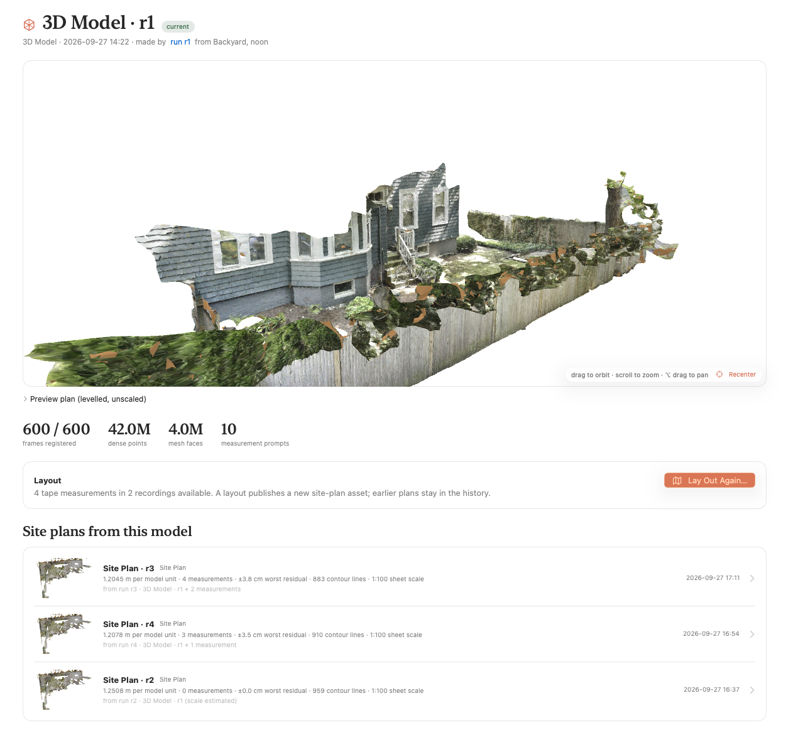
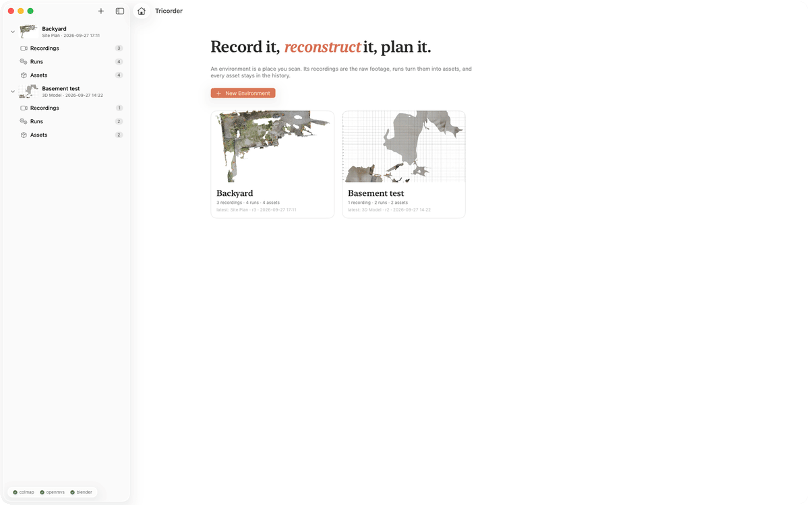
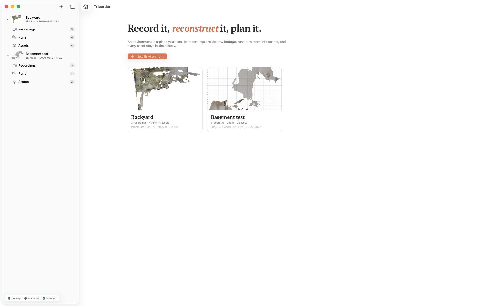
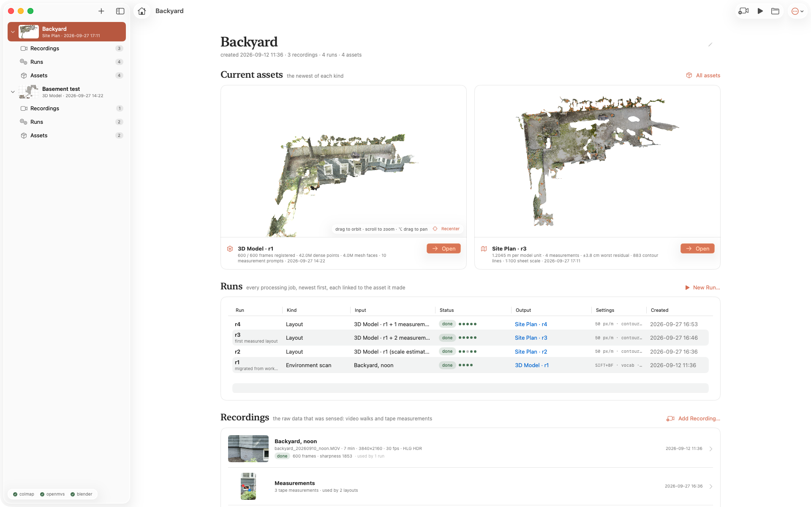
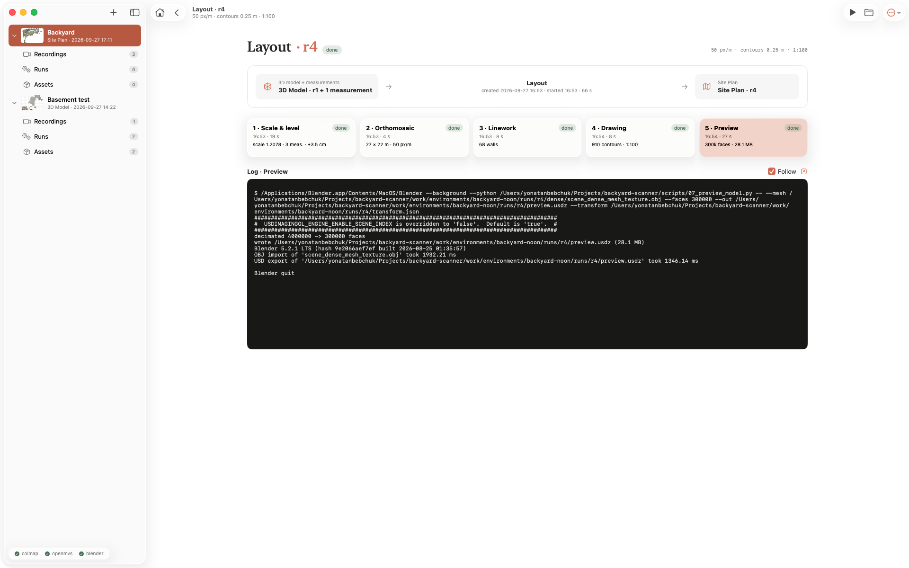
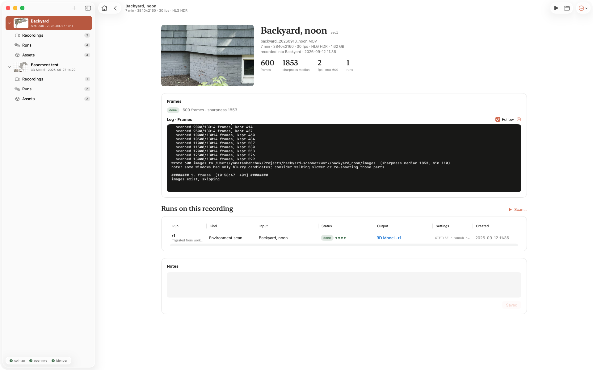

# Tricorder

Point an iPhone at a place. Get back a metric, editable 3D model of it and a dimensioned site plan.
Open source end to end, runs on an Apple Silicon Mac, no NVIDIA GPU.





| | |
|---|---|
|  |  |
| *Home: every place you have scanned* | *An environment: what it is now, how it got there, what was sensed* |
|  |  |
| *A run: what went in, the stages, what came out* | *A recording: the raw footage, its frames, every run on it* |

---

## How it works

Two kinds of run. A **scan** turns a video into a 3D model. A **layout** turns a 3D model plus tape measurements
into a site plan. Everything is a stage script under `scripts/`, orchestrated by `tricorder/pipeline.py`.

```
 iPhone video (4K, 30 fps)
        │  01_extract_frames.py   ffmpeg/OpenCV: the sharpest frame per window, 2 fps, HDR tone-mapped
        ▼
 300-600 JPEG frames                                                        ┐
        │  02_sfm.sh              COLMAP: features, sequential + vocab-tree  │
        │                         matching, relaxed mapper, undistort (CPU)  │
        ▼                                                                    │
 camera poses + sparse cloud                                                 │  scan run
        │  03_dense.sh            OpenMVS: dense cloud, mesh, fragment        │  → 3D Model asset
        │                         cleanup, decimation, texture (CPU)         │
        ▼                                                                    │
 scene_dense.ply · scene_dense_mesh_texture.obj      (arbitrary scale)      │
        │  pick_landmarks.py      levelled preview plan, measurement prompts │
        │  07_preview_model.py    Blender: 300k-face USDZ for the app        ┘
        ▼
 3D Model  +  tape measurements marked on video frames                      ┐
        │  measure_project.py     pixels → rays → mesh hits (pycolmap, Open3D)│
        │  solve_scale.py         scale, level, north → transform.json       │
        ▼                                                                    │
 metric cloud (metres, Z up, north +Y)                                       │  layout run
        │  05_site_plan_blender.py  Blender: orthomosaic at true scale        │  → Site Plan asset
        │  10_trace_walls.py        vertical surfaces → wall lines →          │
        │                           regularised, dimensioned boundary        │
        │  08_site_plan.py          DEM, contours, DXF, PDF sheet, world file │
        ▼                                                                    ┘
 site_plan.dxf · site_plan.pdf · orthomosaic.png + .pgw · dem.tif · site_plan.blend
```

Photogrammetry has no absolute scale, so something in the scene must be measured. Tricorder asks for that
*after* the model exists: it picks long, well-triangulated spans between corners and shows you where they are in
the footage. You tape them on site, type the metres, and the layout solves scale, level and north from them.

## Why these tools

| Need | Choice | Why not the obvious alternative |
|---|---|---|
| Camera poses (SfM) | **COLMAP** (`brew install colmap`) | Gold standard, brew-bottled for arm64. |
| Dense cloud, mesh, texture | **OpenMVS** (built from source, CPU) | COLMAP's own dense step is CUDA-only, so it cannot run on any Mac. OpenMVS reads COLMAP output and does dense + mesh + texture on CPU. |
| Real-world scale | tape-measured spans, or LiDAR poses | Photogrammetry has no absolute scale. |
| Orthomosaic, previews, editing | **Blender** (headless) | Imports the textured OBJ at metric scale, renders the top-down ortho, exports USDZ; the `.blend` is yours to edit. |
| Line drawing | classical geometry: RANSAC lines on vertical structure, polygon regularisation | Learned floorplan models are trained on indoor rooms and need CUDA; see [docs/SITE_PLAN_RESEARCH.md](docs/SITE_PLAN_RESEARCH.md). |
| Drawing formats | **ezdxf** (DXF), matplotlib (PDF sheet), ESRI world file | What architects, QCAD, AutoCAD and QGIS open. |
| Cleanup, measuring | **CloudCompare** | Point picking, cross-sections, cropping. |

Not chosen: Meshroom (no Mac build, CUDA), Gaussian splatting (beautiful, but not measurable or editable),
OpenDroneMap in Docker (works on arm64 and is a fine fallback: `03_dense.sh` uses its OpenMVS binaries if
`docker pull opendronemap/odm` is present and the native build is missing). Apple's Object Capture *area mode*
is free, metric through LiDAR and excellent on this hardware, but not open source; it is the pragmatic escape hatch.

## Setup

macOS on Apple Silicon. Tested on an M4 Mac mini with 24 GB.

```bash
./setup.sh          # brew: colmap ffmpeg + OpenMVS build deps; uv venv with the Python deps; builds OpenMVS into tools/
./setup.sh --apps   # same, plus CloudCompare + MeshLab casks
```

Install Blender into `/Applications` (blender.org, or `brew install --cask blender`); the Makefile and pipeline
expect `/Applications/Blender.app`. QCAD (`brew install --cask qcad`) is handy for the DXF.

For the Mac app: Xcode 26 or newer and `brew install xcodegen`.

## Environments, recordings, runs, assets

An **environment** is a place you scan. It holds three things, all local and git-ignored under `work/`:

| | what | where |
|---|---|---|
| **Recordings** | raw sensed data: an iPhone video (copied in, its metadata, the frames extracted from it), or a set of tape measurements marked on a video's frames | `work/environments/<env>/recordings/<rec>/` |
| **Runs** | processing jobs. A **scan** turns a video recording into a 3D model; a **layout** turns a 3D model plus measurement recordings into a site plan. A run has stages, logs, settings and working files, and publishes exactly one asset | `work/environments/<env>/runs/<run>/` |
| **Assets** | what runs produce: a **3D Model** (`model3d`) or a **Site Plan** (`site_plan`). Files are APFS clones of the run's deliverables, so an asset costs no extra disk | `work/environments/<env>/assets/<asset>/` |

Assets are never overwritten: laying out again publishes `site_plan-2` and `site_plan-1` stays as history. The
newest asset of each kind is the environment's *current* state. Runs consume earlier assets (a layout consumes a
3D model), which is how one asset becomes the input of the next. `tricorder/pipeline.py` is the only writer of run
status; the app only writes names, notes and your measurements. Manifests are plain JSON
(`environment.json`, `recording.json`, `run.json`, `asset.json`); the schema is in `tricorder/models.py`.

**Measurements are recordings** (kind `measurements`). In the app you browse the frames of a video, click two
points on one, and type the metres you taped between them, as many as you like, plus an optional compass bearing
at a frame. A layout takes a 3D model and any number of measurement recordings; `measure_project.py` casts each
pixel pair through that frame's camera onto the model's mesh to get the 3D constraints the scale solver uses.
Items whose frame the model did not register are reported and skipped. With no measurement recording the scale is
*estimated* from the camera height above the ground (phone at chest height, about ±10 %) and the plan says so.
Design notes: [docs/COMPUTATIONS.md](docs/COMPUTATIONS.md).

## Mac app

```bash
make app                   # xcodegen + xcodebuild, then opens Tricorder.app
make xcode                 # generate app/Tricorder.xcodeproj and open it in Xcode
```

A native SwiftUI app (macOS 26). The sidebar lists environments, each with *Recordings*, *Runs* and *Assets*. The
environment page shows the current assets on top (the 3D model in an orbitable SceneKit viewer, the site plan as an
image), then every run linked to the asset it made, then the recordings. A 3D Model page has the viewer, the metrics,
and *Lay Out Site Plan*; a Site Plan page draws the boundary, walls, contours, grid and measurements over the
orthomosaic, lets you rotate the plan to align with any edge, and opens the DXF and PDF; a run page has the stage
chips and the live log.

The app watches `work/environments` with FSEvents and starts work through `python -m tricorder.pipeline launch …`
(detached, under `caffeinate`), so quitting the app never kills a run. On first launch it asks for the checkout
folder (it needs `tricorder/pipeline.py` and `.venv/bin/python`). Sources in `app/Tricorder/`, XcodeGen spec in
`app/project.yml`; the generated project and build products are git-ignored.

`app/Tricorder/App/DebugHooks.swift` documents the `TRICORDER_*` environment variables that size the window, select
a page, render a screenshot or walk the demo tour; the screenshots above were made with them.

## Command line

```bash
make new VIDEO=data/backyard.MOV NAME="Backyard" MAXF=600     # environment + recording + scan run, executes now
make run ENV=backyard RUN=r1                                    # (re)execute: finished stages are kept, asset re-published
python -m tricorder.pipeline run backyard r1 --redo preview     # redo one stage
make layout ENV=backyard ASSET=model3d-1 MEAS="rec2 rec3"       # site plan; omit MEAS for an estimated scale
make list                                                       # environments, recordings, runs, assets
python -m tricorder.pipeline new-run backyard scan --recording rec1 --features ALIKED --matcher LIGHTGLUE --start
python -m tricorder.pipeline new-recording backyard data/evening.MOV --name "Evening walk"
python -m tricorder.pipeline new-measurements backyard --name "Tape, Saturday"   # then add items in the app
make migrate                                                    # old work/scans layout -> work/environments
```

Makefile variables: `FPS`, `MAXF` (frames), `RES_LEVEL` (dense 1/2/3), `FEATURES`, `MATCHER`, `MATCHING`,
`MEASURES` (prompts to ask for), `PXM` (orthomosaic px/m). `run_all.sh <video> [name]` is a thin wrapper around `new`.

## Capturing the video

This is most of the result. Scale comes after filming, so no scale bar is needed in the shot, but filming a few
crisp, permanent corners from more than one angle makes the measurement prompts better.

Camera settings on the iPhone:
- Settings ▸ Camera ▸ Record Video: **4K, 30 fps**. HDR video is tone-mapped by the frame extractor
  (`--hdr hlg`, picked automatically from the stream's transfer characteristic), but HDR off gives slightly
  cleaner colours and is one less thing to go wrong.
- Use the 1× main camera, not ultra-wide. Lock exposure and focus (long-press the subject, AE/AF LOCK) so
  brightness does not pump between frames.
- Overcast or fully shaded is ideal. Avoid harsh sun, branches moving in wind, sprinklers, people, pets.

How to walk:
- Move slowly and smoothly; pause briefly at corners. Blur is the enemy: the extractor keeps the sharpest frames,
  but it cannot fix a whole blurry stretch.
- Walk the perimeter once at chest height with the camera tilted down 20-30°, keeping the ground *and* the
  fences or walls in frame. Never point at empty sky.
- Do a second loop from the inside pointing outwards, and a third at a different height (knee level, or arms
  raised) for walls and structures.
- Each new frame should overlap the previous by 70-80 %: turn slowly.
- 3-6 minutes of video is plenty for a typical yard. Longer only slows COLMAP.

Move the video to `data/` (AirDrop keeps full quality; iCloud "optimize storage" does not).

## The scan run

Stages, in order. Finished stages are kept when a run is re-executed; `--redo <stage>` repeats one.

1. **frames** (`01_extract_frames.py`, on the recording, shared by every run on it): the video is split into
   windows of `source_fps / fps` frames; the sharpest of a few candidates per window (variance of the Laplacian)
   is kept, HDR tone-mapped to SDR. Frames and their sharpness go to `images/frames.csv`.
2. **sfm** (`02_sfm.sh`): COLMAP feature extraction, sequential matching plus vocab-tree retrieval of look-alike
   frames, a relaxed incremental mapper, then undistortion laid out for OpenMVS.
3. **dense** (`03_dense.sh`): OpenMVS densify, mesh, `clean_mesh.py` drops detached fragments under `MIN_FACES`,
   decimation to `MAX_FACES` (4M), texture. Resumable: each product is skipped if it already exists.
4. **landmarks** (`04_scale_model.py --factor 1`, `pick_landmarks.py`): the ground plane is levelled using the
   cameras' mean "up" (`transform_preview.json`), a preview plan is rendered, and the measurement prompts are
   chosen: the longest span first, then spans in other directions, plus one vertical, each with marked-up crops
   of the frames that see both ends.
5. **preview** (`07_preview_model.py`, Blender): the textured mesh decimated to 300k faces with textures capped at
   4096² as `preview.usdz` for the app's viewer (about 30 MB; the 8192² OpenMVS atlas alone would take 256 MB of
   GPU memory per view).

The 3D Model asset carries the dense cloud, the textured mesh, the camera poses (`sparse/`, COLMAP text) and the
COLMAP database alongside the previews and prompts, so later runs work from the asset alone.

COLMAP knobs (environment variables for `02_sfm.sh`, or the run form in the app):

| Variable | Default | Notes |
|---|---|---|
| `FEATURES` | `SIFT` | `ALIKED` = learned keypoints (ONNX on CPU). Better on blank walls and repetitive texture. |
| `MATCHER` | `BRUTEFORCE` | `LIGHTGLUE` = learned matcher; more matches from weak features. Slow on CPU. |
| `MATCHING` | `vocab` | sequential neighbours plus vocab-tree retrieval; `sequential` or `exhaustive` also accepted. |
| `RELAXED` | `1` | mapper accepts images with 15+ inliers instead of 30. |
| `OVERLAP` | `25` | sequential matcher overlap. |
| `MAX_IMAGE_SIZE` | `3200` / `1600` | feature extraction size for SIFT / ALIKED. |
| `UNDISTORT_SIZE` | `2400` | max image size handed to OpenMVS. |

Dense knobs (`03_dense.sh`): `RES_LEVEL` (0 full, 1 half, 2 quarter, default 2), `REFINE=1` (RefineMesh, slow,
sharper), `MIN_FACES` (default 2000), `MAX_FACES`.

Measured on a 286-frame basement test (white walls, soft frames):

| Features + matcher | Registered frames | Sub-models | SfM time on the M4 |
|---|---|---|---|
| SIFT + brute force, default mapper | 81 | 6 | 8 min |
| SIFT + brute force, vocab retrieval + relaxed mapper (default) | 118 | 5 | 13 min |
| ALIKED + LightGlue, vocab retrieval + relaxed mapper | **282** | 1 | ~3 h |

On a 434 s, 600-frame backyard walk with the default settings: 600 of 600 registered in one model, COLMAP 75 min,
dense 40 min, texturing 14 min after decimation.

## The layout run

Input: a 3D Model asset and zero or more measurement recordings. Output: a Site Plan asset.

1. **solve** (`measure_project.py`, `solve_scale.py`): each measurement's two pixels are undistorted with the
   frame's camera (pycolmap, the scan's own OPENCV model), cast as rays from that frame's pose and intersected with
   the mesh (Open3D). Scale is the mean of metres / model distance over the constraints, with each residual reported
   in cm and a spread above 3 % flagged. Level is the dominant plane facing the cameras' up; north is the compass
   bearing of one frame, if given. `transform.json` holds the 4×4 similarity and the residuals; the dense cloud is
   written in metres as `scene_dense_metric.ply`.
2. **ortho** (`05_site_plan_blender.py`, Blender): orthographic top-down render at `px_per_m` (default 50) as
   `orthomosaic.png` with the world coordinates of its corners in `orthomosaic.json`, and `site_plan.blend` with the
   metric mesh and the ortho camera set up for editing.
3. **trace** (`10_trace_walls.py`): the architect's line drawing from the cloud, all classical and seconds on an M4.
   Down-sample to 4 cm and estimate normals; points with a near-horizontal normal between 0.25 m and 3 m up are
   vertical structure (fences, walls, the house, hedges). Rasterise to 5 cm cells and keep cells whose structure
   spans at least `wall_jump_m` (0.5 m) vertically, which drops foliage over a fence. Iterative 2D RANSAC fits one
   line per structure with a measured extent. Snap segments within 12° of the site's dominant axis to it or its
   perpendicular and merge collinear pieces. The usable ground (points within 0.35 m of the levelled ground) is
   rasterised and traced as the boundary polygon, which always closes across gates and porches; it is simplified,
   regularised to the direction families, jogs shorter than `min_edge_m` (1.2 m) absorbed unless a detected wall
   supports them, and every side snapped onto its wall line. Loops the walls close on their own (a shed, a raised
   bed) become enclosures via shapely and buildingregulariser. Every side carries its length. Output `linework.json`.
4. **draw** (`08_site_plan.py`): DEM on a 5 cm grid (`dem.tif`, 32-bit metres), contour lines at `contour_m`
   (0.25 m, index contours every fourth), footprint, the ESRI world file `orthomosaic.pgw`, `site_plan.dxf` and a
   two-page `site_plan.pdf` at 1:100 on A2 (or the largest of 1:50 / 100 / 200 / 500 that fits): the orthomosaic
   plan, then the line drawing. `overlay.json` is what the app draws over the orthomosaic.
5. **preview** (`07_preview_model.py`): the metric, levelled, north-up USDZ for the app's viewer.

DXF layers: `ORTHO` (the orthomosaic as an IMAGE entity in metres), `GRID` / `GRID_MAJOR`, `CONTOURS` /
`CONTOURS_INDEX`, `FOOTPRINT`, `WALLS`, `EDGES`, `BOUNDARY`, `ENCLOSURES`, `DIMENSIONS`, `MEASURE` (the taped
spans with their values and residuals), `NORTH`, `SCALEBAR`, `TITLE`.

Layout settings (run form or `new-run … layout` flags): `px_per_m`, `contour_m`, `wall_jump_m`, `min_edge_m`,
`sheet_scale`, `preview_faces`.

`09_trace_lines.py` is the earlier DEM/Hough tracer, kept for reference; the research that replaced it is in
[docs/SITE_PLAN_RESEARCH.md](docs/SITE_PLAN_RESEARCH.md).

## Working with the deliverables

- **QCAD / AutoCAD / Vectorworks**: open `site_plan.dxf`; the orthomosaic sits on `ORTHO` at true scale, the
  boundary and walls are dimensioned. Trace beds, paths and proposed features on their own layers.
- **QGIS or any GIS**: `orthomosaic.png` with its `.pgw` world file places the image in metres; `dem.tif` for
  slope and drainage.
- **Blender**: open `site_plan.blend`; the mesh is in metres and the ortho camera is set up. MeasureIt-ARCH places
  dimension lines on the model.
- **CloudCompare**: `scene_dense_metric.ply` for cross-sections (fence heights, deck steps, slope) and point picking.
- **Print**: `site_plan.pdf` at the stated scale.

## LiDAR track (Stray Scanner)

An alternative with no photogrammetry: `scripts/lidar_fuse.py` fuses a **Stray Scanner** (open-source iPhone LiDAR
app) recording into a metric mesh directly, using ARKit's poses for scale. Lower detail, but dimensions are right out
of the box; the video track gives the better textured model. You can do both and overlay them.

1. Install Stray Scanner from the App Store. Record the site walking slowly within 3-4 m of everything (LiDAR range).
2. Copy the dataset folder out of the app's Documents via Finder into `data/`.
3. `make lidar LIDAR=data/<dataset-folder> NAME=backyard` writes `work/lidar/backyard_lidar.ply` (metres, Z up)
   plus a plan render with a 1 m grid.

Check the dataset layout against the docstring in `scripts/lidar_fuse.py`; the app's export format has changed
between versions.

## Prototypes

Not wired into the pipeline yet, runnable by hand on a layout run's folder:

- `scripts/11_detect_stairs.py`: stairs from geometry. Horizontal surfaces between 0.08 m and 1.5 m are binned by
  height, clustered in plan, and chained where the rise is consistent (0.10-0.22 m); outputs treads, rise, run,
  width and direction.
- `scripts/12_identify.py`: what is where. Grounding DINO finds concepts by name in a subset of the registered
  frames, SAM masks them, and every mask pixel is lifted onto the mesh through the frame's camera. Ground hits vote
  for a material (lawn, brick, gravel, deck, garden bed) in a 10 cm grid; object hits (doors, gates, windows, stairs,
  trees, the house) are voxelised and clustered into instances seen from at least two frames. About 6 minutes for
  150 frames on the M4 (detector on the GPU, SAM on CPU). Needs `torch` and `transformers`; models download from
  Hugging Face on first use.

Both are described, with results on the backyard, in the second part of
[docs/SITE_PLAN_RESEARCH.md](docs/SITE_PLAN_RESEARCH.md).

## Troubleshooting

- **COLMAP registers few images or several sub-models**: not enough overlap or blur. Lower `FPS` no further than
  1.5; raise `OVERLAP=40`; make sure `LOOP_DETECTION=1` (default; the vocab tree is downloaded to COLMAP's cache on
  first use). Re-shoot with slower turns, or try `FEATURES=ALIKED MATCHER=LIGHTGLUE`.
- **Reconstruction drifts or bends**: loop closure failed. Walk true loops that end where they started and keep the
  same features in view; keep exposure locked.
- **Floating junk in the mesh or plan**: `03_dense.sh` drops detached fragments under `MIN_FACES` (default 2000)
  before texturing. Raise it for a cleaner but sparser model.
- **OpenMVS out of memory**: `RES_LEVEL=3` (eighth resolution), or fewer frames (`MAXF=250`).
- **Texture looks blurry**: `RES_LEVEL=1` (slower), or `REFINE=1` for sharper geometry.
- **Ground plane picked a wall**: the solver uses the cameras' mean "up" to choose among the dominant planes and
  logs each candidate's angle from it. If the pick is still wrong, level the model in CloudCompare
  (*Edit ▸ Apply transformation*) and rerun the layout with `04_scale_model.py --no-ground`.
- **Wrong scale**: check the residuals in `transform.json`; one mis-click on a far point skews the mean. Use three
  or more measurements, long spans over short ones.
- **Measurement skipped**: its frame was not registered by the scan. Mark the same span on a neighbouring frame.

## Repository layout

```
tricorder/      data model (models.py), orchestrator (pipeline.py), stage metrics, migration
scripts/        the stage scripts, numbered in pipeline order, plus helpers
app/            the Mac app (SwiftUI); project.yml is the XcodeGen spec
docs/           design notes, research, screenshots
setup.sh        brew packages, Python venv, OpenMVS build
Makefile        the commands above
work/           environments, recordings, runs, assets (local, git-ignored)
data/           your videos (local, git-ignored)
tools/          the OpenMVS build (local, git-ignored)
```
