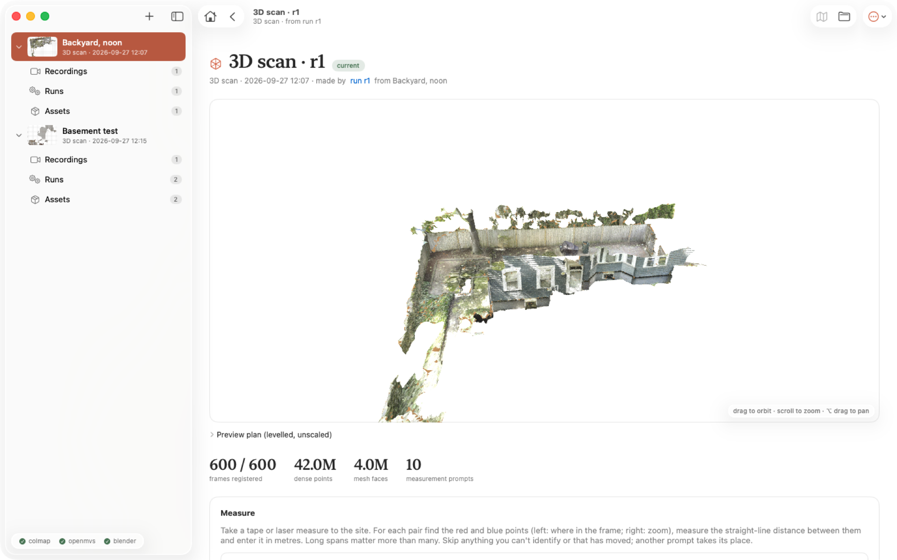

# Tricorder

Point an iPhone at a place, get back a metric, editable 3D scan of it and a dimensioned 2D site plan.
All open source, runs on a Mac mini (Apple Silicon, 24 GB), no NVIDIA GPU needed.


| | |
|---|---|
|  |  |
| *An environment: what it currently is, how it got there, what was sensed* | *A 3D-scan asset: SceneKit viewer, metrics, tape-measure prompts* |
|  |  |
| *A run: what went in, what came out, the five stages and their logs* | *A recording: the raw footage, frame extraction, every run on it* |

```
 iPhone 17 Pro video
        │  01_extract_frames.py   ffmpeg/OpenCV, keeps the sharpest 2 fps
        ▼
 ~300-400 JPEG frames
        │  02_sfm.sh              COLMAP: camera poses + sparse cloud (CPU)
        ▼
 poses + undistorted images
        │  03_dense.sh            OpenMVS: dense cloud → mesh → textured OBJ (CPU)
        ▼
 scene_dense.ply, scene_dense_mesh_texture.obj      (arbitrary scale, arbitrary orientation)
        │  04_scale_model.py      tape-measure pairs → metres, ground plane → Z = 0
        ▼
 transform.json  +  scene_dense_metric.ply
        │  05_site_plan_blender.py  Blender headless: editable .blend + top-down ortho render
        │  06_annotate_plan.py      1 m grid, axis labels, scale bar
        ▼
 plan.blend (edit in Blender) · plan_grid.png (trace in QCAD / Inkscape at true scale)
```

Alternative track, no photogrammetry: `scripts/lidar_fuse.py` fuses a **Stray Scanner** (open-source
iPhone LiDAR app) recording into a metric mesh directly, using ARKit's poses for scale.
Lower detail, but dimensions are right out of the box. Good for the plan; the video track is
better for the pretty textured model. You can do both and overlay them.

## Why these tools

| Need | Choice | Why not the obvious alternative |
|---|---|---|
| Camera poses (SfM) | **COLMAP 4.2** (`brew install colmap`) | Gold standard, brew-bottled for arm64. |
| Dense cloud / mesh / texture | **OpenMVS** (built from source, CPU) | COLMAP's own dense step (`patch_match_stereo`) is CUDA-only, so it cannot run on any Mac. OpenMVS reads COLMAP output and does dense + mesh + texture on CPU. |
| Real-world scale | tape-measured point pairs, or LiDAR poses | Photogrammetry has **no absolute scale**; something in the scene must be measured. |
| Cleanup / measuring | **CloudCompare** | Point picking, distance measuring, cropping, cross-sections. |
| Editing | **Blender** | Import OBJ at metric scale, edit, add proposed features, render. |
| 2D plan | ortho render + **QCAD** (or Inkscape) | Trace fences/walls/beds over the scaled image; QCAD gives proper dimensioned drawings. |

Not chosen: Meshroom (no Mac build, CUDA), Gaussian splatting (beautiful, but not measurable or editable),
OpenDroneMap in Docker (works on arm64 and is a fine fallback — `03_dense.sh` will use its OpenMVS binaries
if `docker pull opendronemap/odm` is present and the native build failed).
Apple's built-in Object Capture *area mode* (Reality Composer on the iPhone → macOS PhotogrammetrySession)
is free, uses the LiDAR for metric scale and gives excellent meshes on this exact hardware, but it is not
open source; it's the pragmatic escape hatch if the open pipeline struggles with your yard.

## Setup

```bash
./setup.sh          # brew: colmap ffmpeg cmake boost eigen opencv@4 cgal libomp nanoflann; uv venv; builds OpenMVS into tools/
./setup.sh --apps   # same, plus CloudCompare + MeshLab casks
```
Install Blender from blender.org into /Applications (or `brew install --cask blender`), and QCAD (`brew install --cask qcad`) for the 2D drawing.

## Environments, recordings, runs, assets

An **environment** is a place you scan (the backyard). It holds three things, all local and git-ignored under `work/`:

| | what | where |
|---|---|---|
| **Recordings** | raw data that was sensed: the iPhone video (copied in), its metadata, the frames extracted from it | `work/environments/<env>/recordings/<rec>/` |
| **Runs** | processing jobs. `reconstruct` turns a recording into a 3D scan; `plan` turns a measured 3D scan into a site plan. A run has stages, logs, settings and working files, and publishes exactly one asset | `work/environments/<env>/runs/<run>/` |
| **Assets** | what runs produce: a **3D scan** (dense cloud, textured mesh, preview plan, measurement prompts, USDZ preview) or a **site plan** (scale/level/north, true-scale plan images, Blender scene, metric cloud). Files are APFS clones of the run's deliverables, so an asset costs no extra disk | `work/environments/<env>/assets/<asset>/` |

Assets are never overwritten: making a plan again publishes `plan2d-2` and `plan2d-1` stays as history. The newest asset of
each kind is the environment's *current* state. Runs can consume earlier assets (a plan run consumes a 3D scan), which is
how one asset becomes the input of the next. `tricorder/pipeline.py` orchestrates the stage scripts and is the only
writer of run status; the app only writes names, notes and your measurements.

## Mac app

```bash
brew install xcodegen      # once; Xcode 26 or newer for Liquid Glass
make app                   # builds app/ and opens Tricorder.app
```
A native SwiftUI app (macOS 26, Liquid Glass). The sidebar lists environments, each with *Recordings*, *Runs* and
*Assets*. The environment page shows the current assets on top (the 3D scan in an orbitable SceneKit viewer, the site plan
as an image), then every run linked to the asset it made, then the recordings inventory; the name is edited in place.
An asset page has the 3D viewer, the *Measure* panel for tape measurements, and *Make Site Plan*; a run page has the
stage chips and the live log. The app watches `work/environments` with FSEvents and starts work through
`python -m tricorder.pipeline launch …` (detached, under `caffeinate`), so quitting the app never kills a run.
Sources: `app/Tricorder/` (XcodeGen spec in `app/project.yml`; `make xcode` opens the project).

## Command line

```bash
make new VIDEO=data/backyard.MOV NAME="Backyard" MAXF=600     # environment + recording + reconstruct run, executes now
make run ENV=backyard RUN=r1                                    # (re)execute: finished stages are kept, asset re-published
python -m tricorder.pipeline run backyard r1 --redo preview     # redo one stage (e.g. a lighter 3D preview)
make plan ENV=backyard ASSET=scan3d-1                           # after answering the scan's measurement prompts
make list
python -m tricorder.pipeline new-run backyard reconstruct --recording rec1 --features ALIKED --matcher LIGHTGLUE --start
python -m tricorder.pipeline new-recording backyard data/evening.MOV --name "Evening walk"
make migrate                                                    # old work/scans layout -> work/environments
```
Options: `FPS`, `MAXF` (frames), `RES_LEVEL` (dense 1/2/3), `FEATURES`, `MATCHER`, `MATCHING`, `MEASURES`, `PXM` (plan px/m).
`run_all.sh <video> [name]` still works as a wrapper around `new`.

## Capturing the video (this is 80% of the result)

**Scale comes after filming.** You no longer need a scale bar in the shot: once the model is built, the
pipeline tells you which distances to tape-measure (fence corner to house corner, post height, and so on).
Filming a few crisp, permanent corners from more than one angle makes those prompts better.

Camera settings on the iPhone 17 Pro:
- Settings ▸ Camera ▸ Record Video: **4K, 30 fps**. HDR video is tone-mapped automatically by the frame extractor
  (`--hdr hlg`), but turning HDR off gives slightly cleaner colours and is one less thing to go wrong.
- Use the 1× main camera, not ultra-wide. Lock exposure/focus (long-press the subject, AE/AF LOCK) so brightness doesn't pump between frames.
- Overcast or fully shaded is ideal. Avoid harsh sun, moving branches in wind, sprinklers, people, pets.

How to walk:
- Move slowly and smoothly; pause briefly at corners. Blur is the enemy — the extractor keeps the sharpest frames, but it can't fix a whole blurry stretch.
- Walk the perimeter once at chest height with the camera tilted slightly down (~20-30°), keeping the ground *and* the fence/walls in frame. Never point at empty sky.
- Do a second loop from the inside pointing outwards, and a third at a different height (knee level, or arms raised) for any walls or structures.
- Each new frame should overlap the previous by 70-80%: turn slowly, don't whip around.
- 3-6 minutes of video is plenty for a typical yard. Longer isn't better; it just slows COLMAP.

Move the video to `data/backyard.mp4` (AirDrop keeps full quality; iCloud "optimize storage" does not).

## What the pipeline does

1. **Frames** (`scripts/01_extract_frames.py`): the sharpest frame per window, HDR tone-mapped to SDR.
2. **COLMAP** (`scripts/02_sfm.sh`): features, sequential + vocab-tree matching, relaxed mapper, undistort.
3. **OpenMVS** (`scripts/03_dense.sh`): dense cloud, mesh, fragment cleanup + decimation to 4M faces, texture. Resumable.
4. **Landmarks** (`scripts/04..06`, `pick_landmarks.py`): levelled unscaled preview plan, plus the measurement prompts.
5. **Preview** (`scripts/07_preview_model.py`, Blender): the textured mesh decimated to 300k faces, textures capped at 4096², as `preview.usdz` for the app's 3D viewer (about 30 MB; the 8192² OpenMVS atlas alone would take 256 MB of GPU memory per view).
6. **Plan** (`solve_scale.py` + Blender, a separate `plan` run on the scan asset): scale / level / north from your answers, `plan_grid.png`, `plan.blend`, metric cloud.

COLMAP knobs (env vars or the run form):

| Variable | Default | Notes |
|---|---|---|
| `FEATURES` | `SIFT` | `ALIKED` = learned keypoints (ONNX on CPU). Better on blank walls and repetitive texture. |
| `MATCHER` | `BRUTEFORCE` | `LIGHTGLUE` = learned matcher; more matches from weak features. Slow on CPU: see below. |
| `MATCHING` | `vocab` | sequential neighbours **plus** vocab-tree retrieval of look-alike frames. |
| `RELAXED` | `1` | mapper accepts images with 15+ inliers instead of 30. |

Measured on the 286-frame basement test (white walls, soft frames):

| Features + matcher | Registered frames | Sub-models | SfM time on the M4 |
|---|---|---|---|
| SIFT + brute force, default mapper | 81 | 6 | 8 min |
| SIFT + brute force, vocab retrieval + relaxed mapper (default) | 118 | 5 | 13 min |
| ALIKED + LightGlue, vocab retrieval + relaxed mapper | **282** | 1 | ~3 h |

And on a 434 s, 600-frame backyard walk with the default settings: 600 of 600 registered in one model,
COLMAP 75 min, dense 40 min, texturing 14 min after decimation.

## Getting the 2D sketch with dimensions

`plan_grid.png` is an orthographic top-down image at a known scale (`plan.json` holds px/m and the
world coordinates of the image corners). Two ways to turn it into a proper drawing:

1. **QCAD** (recommended for a renovation plan): *File ▸ Bitmap ▸ Insert*, then scale the image so the
   1 m grid lines are 1 unit apart. Trace fence lines, house wall, patio, beds, trees as CAD entities and
   add dimensions with the dimension tools. Export PDF/DXF for whoever builds it.
2. **Blender**: open `plan.blend`, enable the *MeasureIt* add-on (or MeasureIt-ARCH, open source) to
   place dimension lines directly on the 3D model, then render the same top camera.

For heights (fence height, deck steps, slope) use CloudCompare's *Cross section* tool on
`scene_dense_metric.ply`, or measure vertex-to-vertex in Blender with the Measure tool (N panel shows metres).

## LiDAR track (Stray Scanner)

1. Install Stray Scanner from the App Store (free, open source). Record the yard walking slowly within ~3-4 m of everything.
2. Connect the phone, copy the dataset folder out of the app's Documents via Finder into `data/`.
3. `make lidar LIDAR=data/<dataset-folder>` → `work/lidar/backyard_lidar.ply` (already in metres, Z-up) plus a plan render.

Verify the dataset layout matches the docstring in `scripts/lidar_fuse.py`; the app's export format has
changed between versions.

## Troubleshooting

- **COLMAP registers few images / several sub-models**: not enough overlap or blur. Lower `--fps` no
  further than 1.5; raise `OVERLAP=40`; make sure `LOOP_DETECTION=1` (default; the vocab tree is
  downloaded to COLMAP's cache on first use). Re-shoot with slower turns.
- **Reconstruction drifts / bends**: loop closure failed. Walk true loops that end where they started
  and keep the same features in view; keep exposure locked.
- **Floating junk in the mesh / plan**: `03_dense.sh` drops detached fragments under `MIN_FACES`
  (default 2000) before texturing. Raise it for a cleaner but sparser model.
- **OpenMVS out of memory**: `RES_LEVEL=3 make dense` (eighth resolution), or fewer images (`MAXF=250`).
- **Texture looks blurry**: `RES_LEVEL=1 make dense` (slower), or `REFINE=1` for sharper geometry.
- **Ground plane picked a wall**: the script uses the average camera "up" (phones are held roughly
  upright) to choose among the dominant planes and prints each candidate's angle from it. If the
  pick is still wrong, rerun with `--no-ground` and level the model in CloudCompare
  (*Edit ▸ Apply transformation*, or the *Level* tool) before rendering.
- **Wrong scale**: check pair residuals; a single mis-click on a far point can skew it. Use ≥3 pairs.
